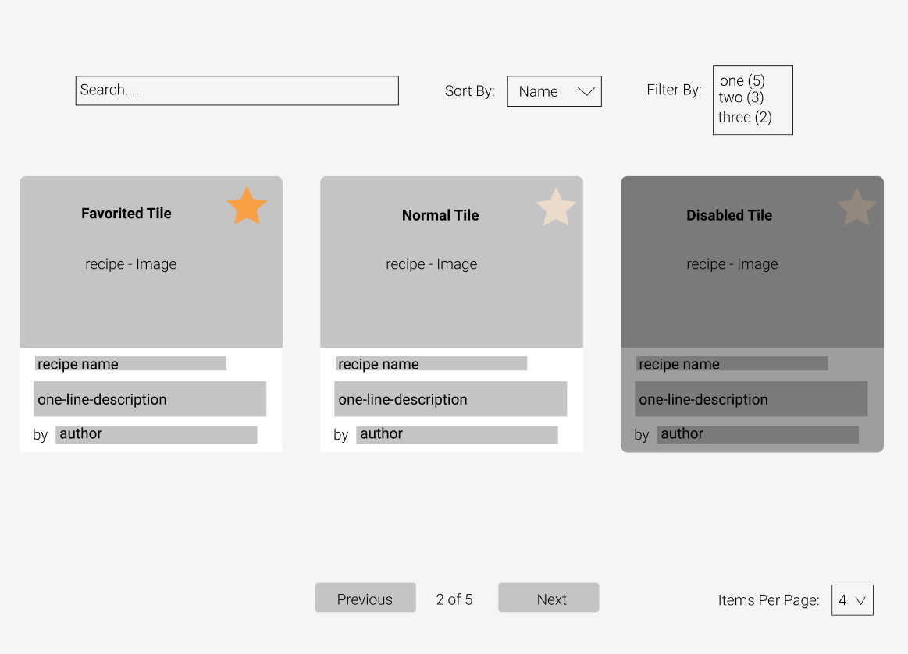

# Givewith front-end engineering exercise
Hello there!

We're excited that you're interested in joining the [Givewith](https://www.givewith.com/) team. To assess your technical aptitude, we've come up with this programming/design challenge that will allow you to showcase your skills from the comfort of your own workspace.

All the best and we are eager to see what you create!

## Overview
You'll be building a simple single-page application (user interface) that shows a list of recipes and allows sorting, searching, filtering and pagination of the recipes.

We have provided you with 3 files:
- mockup.png
- recipes.json
- star.svg

`mockup.png` shows a simple mockup of the application you will be building. It shows a recommended layout of your application's features but feel free to get creative.

`recipes.json` is a json file containing recipes. Each recipe has a `name`, `description`, `image`, `author`, `protein` type, and a `disabled` flag. Use this as the data to power your recipe application

`star.svg` can be used as the image for a favorite button on a recipe.

Below lists the required features your application should have and optional features you can implement if you're feeling adventurous!

### Required Features
- [ ] Recipe tiles are displayed on a page with an `image`, `name`, `description` (truncate to one line), `author` and a favorite button

- [ ] Clicking on the star (favorite button) on a favorited tile unfavorites it and vice-versa (this is indicated by a change in the color of the star)

- [ ] Disabled recipe tiles (recipes with disabled = true) have a black transparent overlay and cannot be favorited

- [ ] A user can search for a recipe using its `name` or `author`

- [ ] A user can sort recipes by either its `name` or `author` (default - `name`)

### Optional Features
- [ ] The recipe list is paginated (pagination is disabled when searching and/or filtering is active)

- [ ] A user can filter recipe list by `protein` type (multiple filters can be applied at the same time); searching is still active when filtering

- [ ] If recipe list is paginated, a user can change how many recipes are shown per page

# Getting Started

To get started, please clone this repo.

You may use any front-end technologies you would like to create the user interface. We are familiar with [React](https://reactjs.org/) + [Typescript](https://www.typescriptlang.org/) and we've heard great things about [Vue](https://vuejs.org/), but please use whatever you're comfortable with.

However, we prefer you do not use any special external packages to implement search/pagination/dropdowns etc., native html elements and some javascript/typescript should work just fine.

Please limit your time on this exercise to a few hours

## Submission

When complete, you can either create and send a link to a public or private GitHub repository (be sure to add `daobeng` as a collaborator if private), or send a ZIP of the completed exercise.

Feel free to reach out to [Daniel](mailto:daniel@givewith.com) with any questions!
